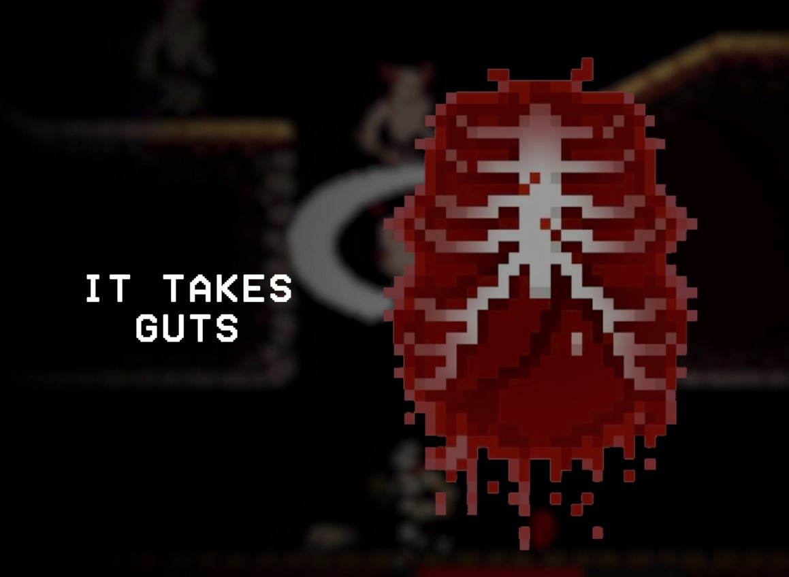
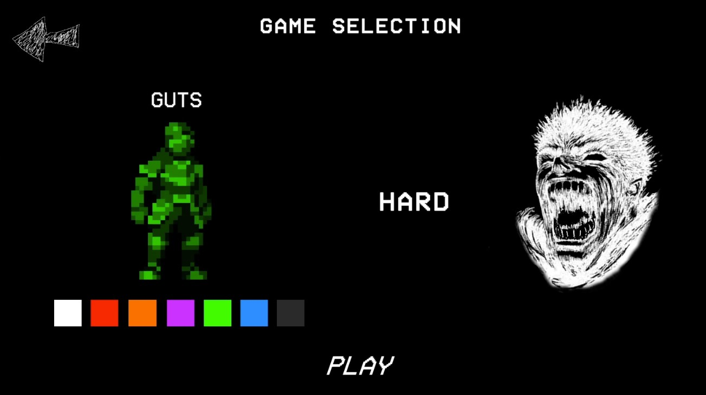

<em>A 2D Hack'N Slash combat platformer powered by Unity Game Engine, inspired by BERSERK.</em>

  
  
  
  

## Demo

https://github.com/anorderh/unity_it_takes_guts/assets/60157725/58363d7b-c8e9-41ff-9695-e476503c7e75

## Overview

</a>

    **It Takes Guts** is a Hack 'N Slash platformer that pits the player against an onslaught of  enemy waves, known as "Demon Imps". Massively outnumbered, the player is encouraged to practice crowd control and constant movement. The player's goal is to eliminate a number of enemies based on the set difficulty. If the player's health is completely depleted before this, they lose. 

## Controls

</a>

* WASD - *move around* 

* W - *jump*

* W (near a wall) - *wall climb*

* S - *crouch*

* SHIFT - *roll (passes enemy hitboxes)* 

* LEFT CLICK or SPACEBAR - *attack*

## Educational

</a>

    This game was made using **Unity Game Engine** and `C#`/`.NET` scripts implementing Unity's framework (MonoBehaviour). Some core features include:

1. Dynamic enemy behavior with player pathfinding, parryable attacks, and spawning throughout the map

2. Unique sprites & animations for player movement, damage, and attacks

3. Win/lose conditions and difficulty scaling

4. UI management and audio integration

For more information regarding the game's design and features, check out the [General Design Document](https://docs.google.com/document/d/1Wxw3b1kfkffYeZ0WUoScJzD7MEI9GRNE/edit?usp=sharing&ouid=100855899086524971871&rtpof=true&sd=true).

## Requirements

* An internet connection to access https://anorde.itch.io/it-takes-guts OR downloaded executable in `Releases/`(Windows only)

* *Recommended* - An NVIDIA graphics card

## Limitations

    To enable enemy pathfinding, the **A-Star Pathfinding Project** was used. However, my implementation is unoptimized and may run near 20-25 fps on slower processors. Moving forward, I would look to implement Unity NavMeshs instead.

## Inspiration

    This game was inspired by various 2D Combat Side-Scrollers such as *Katana Zero* and *Castle Crashers*, and horde mode games such as *Gears of War* and *Left 4 Dead*.

## License

[MIT LICENSE](LICENSE) 
